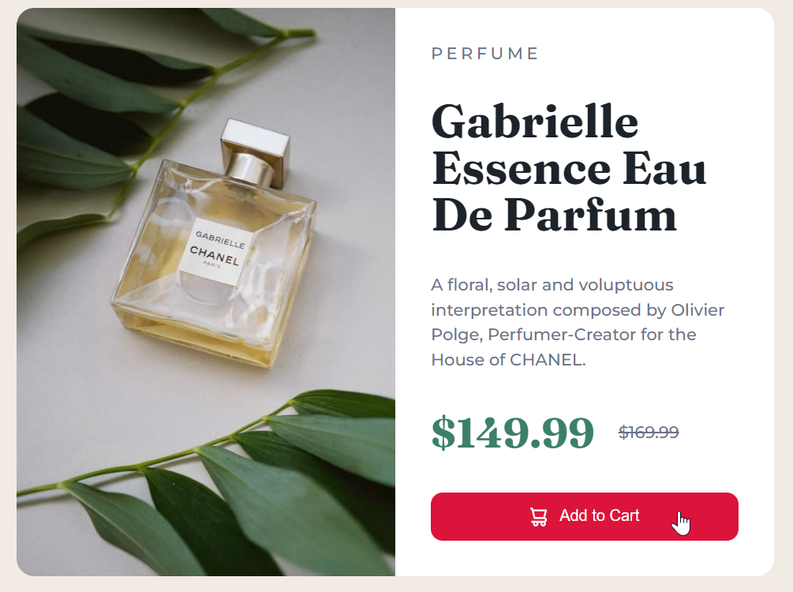

## Project 9

## **Task 19**

The use has to change the text color of **h1 element**.

### **After Update**


### **Project Solution**

```js
// Target the element
const h1Element = document.querySelector("h1.title");

// Change the text color
h1Element.style.color = "darkred";
```

## **Task 20**

The use has to change the Backgroud color of ** Add to card button**.

### **After Update**



### **Project Solution**

```js
// target the button element with class name "add-to-cart"
const buttonElement = document.querySelector(".add-to-cart");

// Change the background color
buttonElement.style.backgroundColor = "darkred";
```
